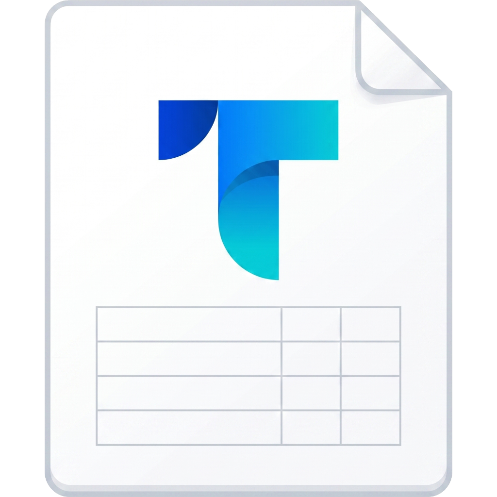

# Takk — Price List Processor

[](https://tauri.app/)
[](https://svelte.dev/)
[](https://www.rust-lang.org/)
[](LICENSE)

**Takk** là một ứng dụng máy tính (Desktop App) mạnh mẽ và tối ưu được xây dựng trên nền tảng **Tauri v2**, **Rust** và **Svelte 5**. Ứng dụng này giúp chuẩn hóa, ánh xạ (mapping), xử lý và hợp nhất hàng loạt bảng giá từ các định dạng Excel (`.xlsx`, `.xls`) hoặc `.csv` khác nhau thành một file bảng giá tổng hợp duy nhất.

<p align="center">
  
</p>

---

## 🚀 Tính năng nổi bật

*   **Tốc độ xử lý vượt trội:** Nhờ có backend viết bằng Rust và thư viện xử lý tệp nhanh (`calamine`, `csv`), Takk có khả năng xử lý các file bảng giá hàng chục nghìn dòng chỉ trong tích tắc.
*   **Kéo & Thả (Drag & Drop) thông minh:** Hỗ trợ kéo thả trực tiếp nhiều tệp tin Excel/CSV từ máy tính vào giao diện ứng dụng.
*   **Chuẩn hóa mã sản phẩm tự động:**
    *   Tự động xóa khoảng trắng, dấu gạch ngang (`-`), và chuyển thành chữ in hoa.
    *   Cấu hình thêm hậu tố (suffix) và vị trí của hậu tố.
*   **Thiết lập quy tắc ánh xạ (Column Mapping):** Dễ dàng ánh xạ các cột thông tin sản phẩm (mã sản phẩm, giá bán, giá gốc, thương hiệu, nhà cung cấp, v.v.) giữa các nhà cung cấp khác nhau về một chuẩn chung.
*   **Quản lý dự án tiện lợi:** Lưu và tải lại tiến trình làm việc dưới định dạng file dự án nén `.bg` riêng biệt của Takk.
*   **Liên kết định dạng tệp tin (File Association):** Tự động liên kết các tệp `.bg` với ứng dụng trên hệ điều hành, cho phép nhấp đúp để mở trực tiếp dự án.
    <p align="center">
      
    </p>
*   **Xuất bản đa dạng:** Xuất file kết quả chất lượng cao dưới dạng `.xlsx` hoặc `.csv`.
*   **Giao diện hiện đại & Responsive:** Hỗ trợ giao diện tối/sáng (Dark/Light Mode) tự động theo hệ thống, thiết kế trực quan tích hợp bộ icon Lucide đẹp mắt.
*   **Tự động cập nhật (Auto Updater):** Tự động kiểm tra phiên bản mới thông qua GitHub Releases để đảm bảo người dùng luôn sử dụng phiên bản mới nhất.

---

## 🛠️ Công nghệ sử dụng

*   **Frontend:** [Svelte 5](https://svelte.dev/) (Sử dụng hệ thống Runes mới cho hiệu năng cực cao và quản lý trạng thái mượt mà), [Vite](https://vite.dev/), [Tailwind CSS](https://tailwindcss.com/)
*   **Backend:** [Tauri v2](https://tauri.app/), [Rust](https://www.rust-lang.org/)
*   **Bộ phân tích dữ liệu Excel/CSV:** `calamine`, `csv` (Rust)
*   **Quản lý gói:** `pnpm`

---

## 💻 Hướng dẫn phát triển và cài đặt

### Yêu cầu hệ thống
Trước khi bắt đầu, hãy đảm bảo hệ tính của bạn đã cài đặt:
1.  **Node.js** (Phiên bản v22 trở lên)
2.  **pnpm** (Trình quản lý gói mặc định cho dự án này)
3.  **Rust & Cargo** (Xem hướng dẫn cài đặt tại [Tauri Prerequisites](https://v2.tauri.app/start/prerequisites/))

### Cài đặt và Chạy Development

1.  **Clone mã nguồn về máy local:**
    ```bash
    git clone https://github.com/phathua/Takk.git
    cd Takk
    ```

2.  **Cài đặt các gói phụ thuộc (Dependencies):**
    ```bash
    pnpm install
    ```

3.  **Khởi động ứng dụng ở chế độ phát triển (Tauri Dev):**
    ```bash
    pnpm tauri dev
    ```

### Đóng gói ứng dụng (Production Build)

Để đóng gói ứng dụng thành file cài đặt chạy trực tiếp (`.exe` trên Windows):
```bash
pnpm tauri build
```

---

## 📅 Quy trình tự động hóa phát hành (GitHub Actions CI/CD)

Dự án tích hợp sẵn GitHub Workflows giúp tự động hóa quá trình đóng gói và phát hành ứng dụng:
*   Mỗi khi đẩy mã nguồn lên nhánh `main`, hệ thống CI/CD sẽ tự động:
    1.  Tăng số phiên bản tự động dựa trên số lần commit từ Git.
    2.  Tự động tạo Changelog (nhật ký thay đổi) liệt kê các commit mới kể từ phiên bản trước đó.
    3.  Đóng gói ứng dụng Tauri và xuất bản bản cài đặt lên mục **GitHub Releases** của Repository.

---

## 📄 Giấy phép

Dự án được phân phối dưới giấy phép **MIT License**. Xem file `LICENSE` để biết thêm chi tiết.
